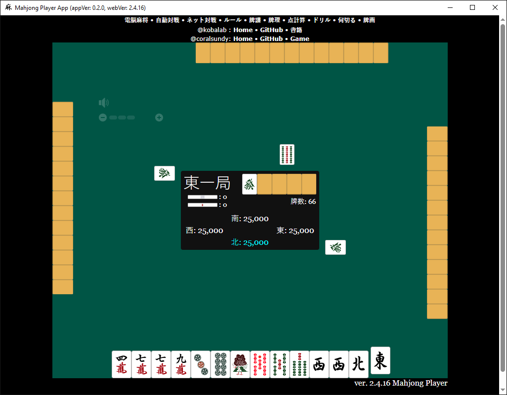

[Mahjong-Player](https://mahjongplayer.app) is a fork of the original mahjong suite ([@kobalab/Majiang](https://github.com/kobalab/Majiang)) created by [@kobalab](https://github.com/kobalab) with contributions from other members.

Several changes are made for my own daily use. It includes but not limited to:

* Easy setup with [Docker container images](#build-docker)
* An [App](#how-to-play) built with [Tauri](https://tauri.app/) to play offline
* Bundle with [@kobalab/majiang-server](https://github.com/kobalab/majiang-server) for easier [local web development](#build-from-source) and netplay in one package  
* More changes are listed in [this section](#notable-changes)

I will take this repository offline if the original author complains. Thanks.

------

### How to Play

#### Mahjong Player Website:

* https://mahjongplayer.app

#### Desktop App:

* https://github.com/coralsundy/mahjong-player/releases

#### Docker Images:

* https://github.com/coralsundy/mahjong-player/pkgs/container/mahjong-player

------

### Notable Changes:

* Add macOS App as well as multi-arch docker images (x64/arm64) to ghcr.io
* Onboard [Tauri](https://tauri.app/) to build mahjong-player into an app
* Make navbar and footer consistent across all the webpages
* Add docker deployment with dockerfile and updated node scripts, auto deploy package with ghcr.io registry
* Bundle @kobalab/majiang-server with the game frontend as a whole, update node scripts
* Switch from @kobalab/tenhou-log server mode to import libs in order to obtain logs from tenhou xml then convert to json

------

### Build from Source

#### Build Web:

* `npm install` - Install all dependencies
* `npm run build:all-dev` / `npm run build:all-prod` - Build static site (./dist), update config/\*.json for different base_url
* `npm run build:all-docker` - Reserved for docker so that html PUG will apply localhost:8080 and pull og:image from github so not bound to specific domain name
* `npm run build:all-app` - Reserved for app, similar to `npm run build:all-docker` but specifically generated for app
* `npm run server` - Start majiang backend express server and host `dist` after building docs
* `npm run bot` - Show commands to start bot and connect to the server

#### Build App:

* The app is built with [Tauri](https://tauri.app/), please install [rustup](https://rustup.rs/) and ensure rust version up to date
* `npm install` - Install all dependencies
* `npx tauri dev` - Build static site, start express server, build tauri app and serve the content
* `npx tauri build` - Build static site (with docker config), build tauri app with installer based on host arch/plat

**Note: A few dependencies may be required for building on linux, see [build-dist-apps.yml](.github/workflows/build-dist-apps.yml).**

#### Build Docker:

* Build docker image manually and deploy:
  * `docker build -t mahjong-player:latest -f Dockerfile .`
  * `docker run -d -p 8080:8080 mahjong-player:latest`
* Pull existing image from [GitHub Packages](https://github.com/coralsundy/mahjong-player/pkgs/container/mahjong-player), build per commit:
  * `docker pull ghcr.io/coralsundy/mahjong-player:latest` # Or other tags
  * `docker run -d -p 8080:8080 ghcr.io/coralsundy/mahjong-player:latest`

------

### Versioning

Mahjong-Player follows a casual development cycle. For releases, we use [CalVer](https://calver.org/) to mark overall versions.

Each release includes two main components and often released together:

* The Web code [@kobalab/Majiang](https://github.com/kobalab/Majiang) stays in sync with the upstream for now, but may branch off later if major features are added.  
* The App code uses [SemVer](https://semver.org/) to track major, minor, and patch changes, just like Web.

------

## Original README:

<h1></h1>

HTML5 + JavaScript で動作する麻雀アプリ「電脳麻将」

## デモ
https://kobalab.net/majiang/

## ライセンス
[MIT](https://github.com/kobalab/Majiang/blob/master/LICENSE)

## 作者
[Satoshi Kobayashi](https://github.com/kobalab)

## npm-scripts
| コマンド        | 説明
|:----------------|:-------------------------------------------
| ``release``     | リリース用にビルドする。
| ``build``       | デバッグ用にビルドする。
| ``build:js``    | JavaScriptのみデバッグ用にビルドする。
| ``build:css``   | CSSのみビルドする。
| ``build:html``  | HTMLのみビルドする。

## サブパッケージ
以下のサブパッケージを使って構成しています。

### majiang-core
 - GitHub: https://github.com/kobalab/majiang-core
 - npm: @kobalab/majiang-core

手牌の操作、シャンテン数・和了点計算、局進行・卓情報の管理、思考ルーチンの雛形を含む基本クラス群です。

### majiang-ai
 - GitHub: https://github.com/kobalab/majiang-ai
 - npm: @kobalab/majiang-ai

麻雀AIとその 開発ツール です。
AIは majiang-core のクラス Majiang.Player の具体的な実装になっています。

### majiang-ui
 - GitHub: https://github.com/kobalab/majiang-ui
 - npm: @kobalab/majiang-ui

手牌表示、盤面表示、牌譜再生 など画面表示やユーザとのインタラクションを実現するクラス群です。

### tenhou-url-log
 - GitHub: https://github.com/kobalab/tenhou-url-log
 - npm: @kobalab/tenhou-url-log

電脳麻将の牌譜をネット麻雀 [天鳳](https://tenhou.net) の[JSON形式の牌譜](https://tenhou.net/6/)(各種AI解析の事実上の共通フォーマット)に変換する機能を提供します。

## 関連パッケージ
そのほかに以下の関連パッケージがあります。

### majiang-server
 - GitHub: https://github.com/kobalab/majiang-server
 - npm: @kobalab/majiang-server

WebSocketによる麻雀サーバーの実装です。
電脳麻将のネット対戦は本サーバに接続して実現しています。

### majiang-analog
 - GitHub: https://github.com/kobalab/majiang-analog
 - npm: @kobalab/majiang-analog

牌譜解析ツールです。
電脳麻将形式の牌譜を解析する基底クラスを提供します。
本クラスのサブクラスを作成し、解析のためのプログラムを書くことができます。

### tenhou-log
 - GitHub: https://github.com/kobalab/tenhou-log
 - npm: @kobalab/tenhou-log

ネット麻雀 [天鳳](https://tenhou.net) の牌譜を電脳麻将形式に変換します。
本パッケージを利用することで天鳳の牌譜を解析したり、再生したりすることが可能になります。
電脳麻将 牌譜ビューアの天鳳牌譜再生は本サーバに接続して実現しています。

## 書籍

電脳麻将のプログラムを解説した書籍を出版しました。
 - [対戦型麻雀ゲームAIのアルゴリズムと実装](https://www.amazon.co.jp/dp/4798067881)

書籍ではサブパッケージの [majiang-core](#majiang-core) と [majiang-ai](#majiang-ai) を扱っています。

## ブログ記事

書籍出版以降(ver.2.0.0以降)の情報です(カッコ内は執筆時のバージョン)。

- 牌譜エディタ
  - [牌譜エディタの使い方](https://blog.kobalab.net/entry/2024/10/28/000539) (v2.4)
  - [電脳麻将でNAGA解析用のデータを作成する](https://blog.kobalab.net/entry/2024/11/02/223910) (v2.4)
- 麻雀サーバー
  - [麻雀サーバーの使い方](https://blog.kobalab.net/entry/2024/02/15/081605) (v2.3)
  - [Passportで外部認証を実現する](https://blog.kobalab.net/entry/2024/02/19/211526) (v2.3)
  - [ネット対戦の持ち時間設定方法](https://blog.kobalab.net/entry/2024/02/17/120315) (v2.3)
  - [麻雀ボットの実装](https://blog.kobalab.net/entry/2025/01/20/205434) (v2.4)
  - [偽ラグの実装](https://blog.kobalab.net/entry/2025/01/26/194556) (v2.4)
- 点数計算ドリル
  - [電脳麻将 ver.2.2.0 公開#点数計算ドリル](https://blog.kobalab.net/entry/2023/12/24/220847#%E7%82%B9%E6%95%B0%E8%A8%88%E7%AE%97%E3%83%89%E3%83%AA%E3%83%AB) (v2.2)
  - [麻雀の点数計算方法(正式版・簡易版)](https://blog.kobalab.net/entry/2023/12/11/204103) (v2.2)
- アルゴリズム・その他
  - [麻雀AIの作り方](https://blog.kobalab.net/entry/2025/02/20/010020) (v2.4)
  - [鳴かない麻雀の成績への影響をシミュレーションする](https://blog.kobalab.net/entry/2025/02/28/203123) (v2.4)
  - [リーチ禁止の影響をシミュレーションする](https://blog.kobalab.net/entry/2025/03/06/214245) (v2.4)
  - [天鳳鳳凰卓統計(2023年)](https://blog.kobalab.net/entry/2024/11/04/215201) (v2.4)
  - [バックトラックで麻雀の和了形一覧を求める](https://blog.kobalab.net/entry/2024/09/16/111847) (v2.3)
  - [麻雀の「待ち」を出力するプログラム](https://blog.kobalab.net/entry/2022/05/01/181217) (v2.0)
  - [麻雀アプリのデバッグに使える牌姿](https://blog.kobalab.net/entry/2022/04/17/174206) (v2.0)
  - [天鳳鳳凰卓の最高・最大・最長記録](https://blog.kobalab.net/entry/2024/11/27/034233) (v2.4)

## (旧)ブログ記事

過去のブログ記事。
内容はやや古いです。
ver.2.0.0 のプログラムの情報は [書籍](#書籍) をご覧ください。
カッコ内は執筆時のバージョンです。

- プログラム構成
  - [電脳麻将のプログラム構成(0) ～ 全体編](https://blog.kobalab.net/entry/2020/07/19/212824) (v1.4)
  - [電脳麻将のプログラム構成(1) 〜 JavaScript編](https://blog.kobalab.net/entry/2020/07/24/234523) (v1.4)
  - [電脳麻将のプログラム構成(2) 〜 HTML/CSS編](https://blog.kobalab.net/entry/2020/07/29/003536) (v1.4)
- 手牌などのデータ構造
  - [麻雀の手牌のJavascript表現](https://blog.kobalab.net/entry/20151211/1449838875) (v0.2)
  - [麻雀の手牌の文字列表現](https://blog.kobalab.net/entry/20151218/1450441130) (v0.2)
  - [牌山と河のデータ構造](https://blog.kobalab.net/entry/2020/09/23/201841) (v1.4)
  - [電脳麻将の牌譜形式](https://blog.kobalab.net/entry/20151228/1451228689) (v0.3)
- シャンテン数計算
  - [向聴数を求めるプログラム(七対子・国士無双編)](https://blog.kobalab.net/entry/20151215/1450112281) (v0.2)
  - [向聴数を求めるプログラム(一般手編(再))](https://blog.kobalab.net/entry/20151216/1450191666) (v0.2)
  - [向聴数を求めるプログラム(一般手編(再々))](https://blog.kobalab.net/entry/20151217/1450357254) (v0.2)
  - [向聴数を求めるプログラム(修正版)](https://blog.kobalab.net/entry/20170917/1505601161) (v0.9)
- 和了点計算
  - [麻雀の和了点を計算するプログラム](https://blog.kobalab.net/entry/20151221/1450624780) (v0.3)
  - [麻雀の和了点の計算 ～ 状況役と懸賞役の一覧を作る](https://blog.kobalab.net/entry/20151222/1450710990) (v0.3)
  - [和了形を求めるプログラム(特殊形)](https://blog.kobalab.net/entry/20151223/1450796906) (v0.3)
  - [和了形を求めるプログラム(一般形)](https://blog.kobalab.net/entry/20151224/1450883400) (v0.3)
  - [麻雀の符を求めるプログラム](https://blog.kobalab.net/entry/20151225/1450970516) (v0.3)
  - [麻雀の役を判定するプログラム(再)](https://blog.kobalab.net/entry/20151226/1451057134) (v0.3)
  - [麻雀の和了点を計算するプログラム(最終回)](https://blog.kobalab.net/entry/20151227/1451142872) (v0.3)
- ゲーム進行
  - [麻雀の局進行のプログラム方式](https://blog.kobalab.net/entry/20151229/1451315733) (v0.3)
  - [麻雀の局進行のプログラム実装](https://blog.kobalab.net/entry/20151230/1451403553) (v0.3)
  - [麻雀の局進行の状態遷移](https://blog.kobalab.net/entry/20151231/1451487890) (v0.3)
  - [麻雀ルールのカスタマイズ(0) ～ ルール一覧](https://blog.kobalab.net/entry/2021/05/01/091041) (v2.0)
  - [麻雀ルールのカスタマイズ(1) ～ 終局判断とポイント計算](https://blog.kobalab.net/entry/2021/05/05/165116) (v2.0)
  - [麻雀ルールのカスタマイズ(2) ～ 流局処理と連荘判断](https://blog.kobalab.net/entry/2021/05/11/070443) (v2.0)
  - [麻雀ルールのカスタマイズ(3) ～ 赤牌とドラ](https://blog.kobalab.net/entry/2021/12/13/213403) (v2.0)
  - [麻雀ルールのカスタマイズ(4) ～ 和了役と点計算](https://blog.kobalab.net/entry/2021/12/15/064735) (v2.0)
  - [麻雀ルールのカスタマイズ(5) ～ 打牌制約](https://blog.kobalab.net/entry/2021/12/17/013546) (v2.0)
- 思考ルーチン
  - [麻雀AIのプログラム構造](https://blog.kobalab.net/entry/20160102/1451703115) (v0.4)
  - [麻雀の打牌選択アルゴリズム(1)](https://blog.kobalab.net/entry/20160103/1451781343) (v0.4)
  - [麻雀の打牌選択アルゴリズム(2)](https://blog.kobalab.net/entry/20160104/1451907283) (v0.4)
  - [麻雀の打牌選択アルゴリズム(3)](https://blog.kobalab.net/entry/20160105/1451998413) (v0.4)
  - [ベタオリのアルゴリズム](https://blog.kobalab.net/entry/20161204/1480808089) (v0.5)
  - [麻雀の副露判断アルゴリズム(1)](https://blog.kobalab.net/entry/20161212/1481471543) (v0.6)
  - [麻雀の副露判断アルゴリズム(2)](https://blog.kobalab.net/entry/20161213/1481557260) (v0.6)
  - [麻雀の副露判断アルゴリズム(3)](https://blog.kobalab.net/entry/20161214/1481644278) (v0.6)
  - [麻雀の副露判断アルゴリズム(4)](https://blog.kobalab.net/entry/20161215/1481809226) (v0.6)
  - [麻雀の打牌選択アルゴリズム(4)](https://blog.kobalab.net/entry/20170731/1501502063) (v0.9)
  - [麻雀の打牌選択アルゴリズム(5)](https://blog.kobalab.net/entry/20170802/1501673312) (v0.9)
  - [麻雀の打牌選択アルゴリズム(6)](https://blog.kobalab.net/entry/20170806/1502026197) (v0.9)
  - [麻雀の打牌選択アルゴリズム(7)](https://blog.kobalab.net/entry/20170813/1502605785) (v0.9)
  - [麻雀の打牌選択アルゴリズム(8)](https://blog.kobalab.net/entry/20170819/1503150574) (v0.9)
  - [麻雀の副露判断アルゴリズム(5)](https://blog.kobalab.net/entry/20170822/1503401216) (v0.9)
  - [麻雀の打牌選択アルゴリズム(9)](https://blog.kobalab.net/entry/20170826/1503705167) (v0.9)
  - [押し引き表の牌姿は評価値何点？](https://blog.kobalab.net/entry/2020/12/09/002002) (v1.5)
  - [押し引きアルゴリズムの改善(1)](https://blog.kobalab.net/entry/2020/12/21/202933) (v1.5)
  - [押し引きアルゴリズムの改善(2)](https://blog.kobalab.net/entry/2020/12/25/205627) (v1.5)
  - [押し引きアルゴリズムの改善(3)](https://blog.kobalab.net/entry/2021/01/02/163535) (v1.5)
  - [天鳳鳳凰卓の牌の危険度表](https://blog.kobalab.net/entry/2021/01/16/130716) (v1.6)
  - [牌の危険度計算アルゴリズム(1)](https://blog.kobalab.net/entry/2021/01/22/204805) (v1.6)
  - [牌の危険度計算アルゴリズム(2)](https://blog.kobalab.net/entry/2021/10/28/232300) (v1.6)
  - [牌の危険度計算アルゴリズム(3)](https://blog.kobalab.net/entry/2021/11/15/080258) (v1.6)
  - [牌の危険度計算アルゴリズム(4)](https://blog.kobalab.net/entry/2021/11/22/071442) (v1.6)
- 表示処理
  - [電脳麻将におけるMVCの実装](https://blog.kobalab.net/entry/2021/03/25/205151) (v1.5)
  - [麻雀の手牌を表示するプログラム](https://blog.kobalab.net/entry/2020/08/14/234729) (v1.4)
- その他
  - [電脳麻将のプログラム中の中国語一覧](https://blog.kobalab.net/entry/20170722/1500688645) (v0.8)
  - [天鳳の牌譜形式を解析する(1)](https://blog.kobalab.net/entry/20170225/1488036549) (v0.8)
  - [天鳳の牌譜形式を解析する(2)](https://blog.kobalab.net/entry/20170228/1488294993) (v0.8)
  - [天鳳の牌譜形式を解析する(3)](https://blog.kobalab.net/entry/20170312/1489315432) (v0.8)
  - [天鳳の牌譜形式を解析する(4)](https://blog.kobalab.net/entry/20170720/1500479235) (v0.8)
  - [牌画入力ツール](https://blog.kobalab.net/entry/20161218/1482078427) (v0.7)
  - [電脳麻将で天鳳の牌譜を検討する](https://blog.kobalab.net/entry/2020/07/08/080228) (v1.4)
  - [デュプリケート麻雀の実装](https://blog.kobalab.net/entry/2020/12/19/075529) (v1.5)

## 謝辞
ゲームで使用している牌画像は [麻雀の画像・素材](http://www.civillink.net/fsozai/majan.html)、
音声は [天鳳用オリジナルSE: アンコロキングblog](http://ancoro.way-nifty.com/blog/se.html)
のものを使用させていただいてます。
